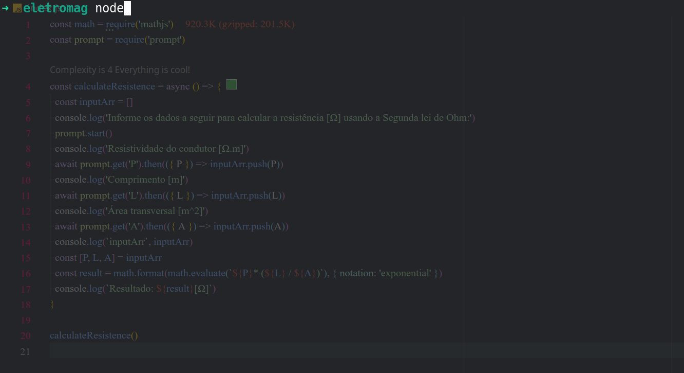

## Programa para calcular a resistência usando a Fórmula da 2ª lei de Ohm

R – Resistência (Ω)

ρ – Resistividade (Ω.m)

L – Comprimento (m)

A – Área transversal (m²)

Onde: `R = ρ \* (L/A)`

De acordo com essa fórmula, a resistência elétrica de um fio condutor é diretamente proporcional ao seu comprimento, além disso, é inversamente proporcional à área de sua secção transversal (chamada coloquialmente de bitola).

### Para rodar

> Instale o nodeJS

> Clone esse git com git clone https://github.com/robertveloso/segunda-lei-de-ohm

> Rode os comandos

| yarn && node index.js

